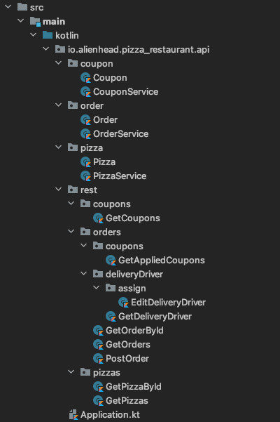

Kleuth uses the directory tree to map requests to handler functions. 
To create REST API routes, simply create a directory structure that mirrors the expected routing of the API.

These docs use the example below, where `kleuth.core.pathToRoot` has been set to `io/alienhead/pizza_restaurant/api/rest`.



### Defining the API

A url path segment is defined by creating a directory. 
The `pizzas` directory in the example corresponds to the url `/pizzas`. 
`Request Handler` classes are created inside those directories to handle specific request methods at that route. The `GetPizzas` class handles `GET` requests to `/pizzas`.


### Hyphens
If there are multiple words in a path segment, it is conventional to separate them with hyphens (`-`).
Kotlin and Java do not allow for hyphens in directory names. 
Use [camel case](https://en.wikipedia.org/wiki/Camel_case) in a directory name and Kleuth will convert it to hyphenated (also known as [kebab case](https://en.wikipedia.org/wiki/Kebab_case)

In the example, the directory `deliveryDriver` will be converted to `delivery-driver`.

### Overriding the Path
If for some reason the directory structure cannot match the REST API, the path can be manually set in the request handler class.

### Full Example
The example directory structure would map to the following REST API

```
GET   /coupons

GET   /orders
POST  /orders
GET   /orders/{id}
GET   /orders/{id}/coupons
GET   /orders/{id}/delivery-driver
POST  /orders/{id}/delivery-driver/assign 
PUT   /orders/{id}/delivery-driver/assign

GET   /pizzas
GET   /pizzas/{id}
```

(`POST  /orders/{id}/delivery-driver/assign` and `PUT /orders/{id}/delivery-driver/assign` are both defined in the `EditDeliveryDriver` class.)
