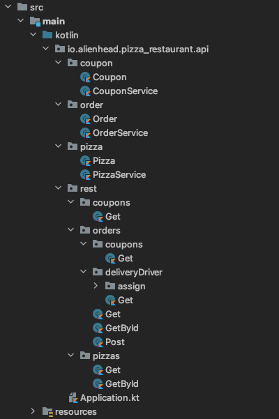

Route handler classes can be created in a few ways, depending on preferred style.

### RouteController

`RouteController` is the standard annotation that tells Kleuth a class handles one or more request methods.
Classes with this annotation should have unique names `GetPizzas`, `GetOrders`, etc. 
Classes with `@RouteController` are also annotated with the Spring `@RestController` annotation, allowing for backwards compatibility.

A class using the `RouteController` annotation would look like this:

```kotlin
@RouteController
class GetPizzas { 
    // ...
}
```

### Route
Classes can instead be annotated with `Route`. 
`Route` must be used along with the Spring `RestController` annotation. 
This allows you to set a request method as the class name:

```kotlin
@Route
@RestController("get-pizzas")
class Get { 
    // ...
}
```

This style can make the directory structure even more concise:




## Request Method Handler Functions

A `Route` or `RouteController` class may handle one, or many request methods through several styles of functions.

### Handler

The word `handler` is a reserved function name which tells Kleuth the class has one request method handler.
In this case, the class name should start or end with the request method handled by the function.

Using the pizza api example, it would look like this:
```kotlin
@RouteController
class GetPizzas(private val service: PizzaService) {
    fun handler(): ResponseEntity<List<Pizza>> {
        return ResponseEntity.ok(service.getAll())
    }
} 
```

### Request Method as Function Name
The request method handler function can be named after one of the supported request methods (get, post, put, delete):
```kotlin
@RouteController
class GetPizzas(private val service: PizzaService) {
    fun get(): ResponseEntity<List<Pizza>> {
        return ResponseEntity.ok(service.getAll())
    }
} 
```

Use this style to put more than one request method in one route handler class:

```kotlin
@RouteController
class EditDeliveryDriver(private val service: OrderService) {

    fun post(/* ... */): ResponseEntity<Unit> {
        // ...
    }

    fun put(/* ... */): ResponseEntity<Unit> {
        // ...
    }
}
```

### Request Method as Annotation
Using the request method annotations can free up the function name to be more specific:
```kotlin
@RouteController
class GetPizzas(private val service: PizzaService) {
    @Get
    fun getAllPizzas(): ResponseEntity<List<Pizza>> {
        return ResponseEntity.ok(service.getAll())
    }
} 
```

Use this style to put more than one request method in one route handler class:

```kotlin
@RouteController
class EditDeliveryDriver(private val service: OrderService) {

    @Post
    fun assignDeliveryDriver(/* ... */): ResponseEntity<Unit> {
        // ...
    }

    @Put
    fun reassignDeliveryDriver(/* ... */): ResponseEntity<Unit> {
        // ...
    }
}
```

:::note

Since one of Kleuth's goals is to de-obfuscate the REST API structure, 
it is not recommended for route handler classes to have more than one request method handler function.
:::


## Overridding the Path

It is possible to override the dynamic path Kleuth would create. 
This is useful if the path does not match the directory structure, *but should be used only when necessary.*

Simply pass the override path into the `Route` or `RouteController` annotation:
```kotlin
@RouteController("/pizzas/{pizzaId}")
class GetPizzaById(
    private val service: PizzaService
) {
    fun get(@PathVariable id: UUID): ResponseEntity<Pizza> {
        val pizza = service.findById(id) ?: throw Exception("Pizza not found")
        return ResponseEntity.ok(pizza)
    }
}
```

The path string should be formatted as one would format a Spring `RequestMapping` path.
:::note
All route handler classes nested under the route handler with the overridden path must also manually set their path
:::
