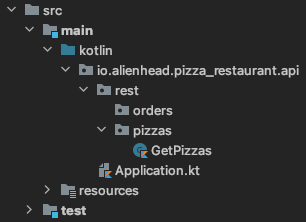

## Add the Kleuth dependency to your project

### Gradle:

```kotlin title="build.gradle.kts"
implementation("io.alienhead.kleuth:kleuth-framework")
```

## Enable Kleuth on the Application class

Add the Kleuth Autoconfiguration annotation `@EnableKleuth` to the main `Application` class.

```kotlin title="Application.kt"
@EnableKleuth
@SpringBootApplication
class Application

fun main(args: Array<String>) {
  runApplication<Application>(*args)
}
```

## Set the necessary application properties

Kleuth needs to know the fully qualified path to the root of the REST API.
This is set with the `kleuth.core.pathToRoot` property.

```kotlin title="application.properties"
kleuth.core.pathToRoot=PATH_TO_ROOT_OF_API
```

### Example

With the following directory structure:



The user expects a `GET` `/pizzas` endpoint off the root of the REST API.

Therefore, `kleuth.core.pathToRoot` should be set like this:
```kotlin title="application.properties"
kleuth.core.pathToRoot=io/alienhead/pizza_restaurant/api/rest
```
If running locally, the `GET` pizzas endpoint would be served at `localhost:8080/pizzas`.

### 

If the `pathToRoot` property were to be set as follows:
```kotlin title="application.properties"
kleuth.core.pathToRoot=io/alienhead/pizza_restaurant/api/rest/pizzas
```

The `GET` pizzas endpoint would be served at `localhost:8080` and the `orders` package would be ignored.

## That's it!

With `@EnableKleuth` and the `pathToRoot` property set, you are ready to dynamically build your Spring REST API with Kleuth!
